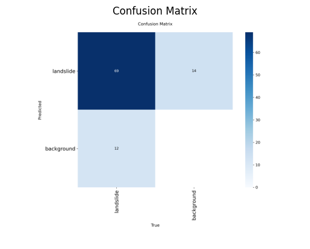

# 🛰️ GeoSentinel — AI-Powered Landslide Detection System

<p align="center">
  
  
  
  
  
</p>

<p align="center">
  <b>Real-time landslide detection from satellite & drone imagery using YOLOv8 segmentation — with live maps, SMS alerts, and email notifications.</b>
</p>

---
## 📋 Table of Contents

1. [Project Overview](#-project-overview)
2. [Objectives](#-objectives)
3. [Dataset Description](#-dataset-description)
4. [Preprocessing & Augmentation](#-preprocessing--augmentation)
5. [Model Architecture](#-model-architecture)
6. [Training Configuration](#-training-configuration)
7. [Training Performance](#-training-performance)
8. [Model Performance Metrics](#-model-performance-metrics)
9. [Detection Results](#-detection-results)
10. [How It Works & UI](#-how-it-works--ui)
11. [Real-World Use Case](#-Real-World-Use-Case)
12. [Conclusion](#-conclusion)
13. [References](#-references)

---

## 🌍 Project Overview

**GeoSentinel** is an AI-powered disaster detection system built to identify landslides in real time from satellite images, aerial photographs, and drone video footage. Powered by **YOLOv8 instance segmentation**, the application delivers immediate visual analysis, geographic risk mapping, and automated emergency alerts — all through a clean, dark-themed web UI built with Streamlit.

The system is designed for field deployment by disaster management agencies, providing a pipeline that goes from raw image input to SMS + email alerts sent to officers in seconds.

---

## 🎯 Objectives

- Detect landslide regions in images and video frames with high accuracy using deep learning segmentation.
- Provide real-time confidence scoring and risk level classification (High / Low / None).
- Automatically send **SMS alerts** (via Twilio) and **Email alerts** (via SendGrid) to field officers upon detection.
- Pin detected landslide locations on an **interactive Folium map** with GPS coordinates and a 1 km evacuation radius.
- Analyze **drone video footage** frame-by-frame and generate annotated output video.
- Log detection data to a persistent CSV database and render a **landslide heatmap** over time.

---

## 📦 Dataset Description

The model was trained on a custom landslide segmentation dataset assembled from multiple public and satellite imagery sources.

| Split | Images | Proportion |
|-------|--------|------------|
| Train | 711 | 87% |
| Valid | 70 | 9% |
| Test | 40 | 5% |
| **Total** | **821** | **100%** |

> ⚠️ **Note:** The initial raw collection comprised **327 images**. After augmentation (3× outputs per training example), the effective dataset grew to **821 annotated images**.

**Dataset sources and further details:**  
🔗 [Roboflow Landslide Segmentation Dataset](https://universe.roboflow.com/sujans-workspace/landslides-2/dataset/3) 
🔗 [Kaggle Landslide4Sense](https://www.kaggle.com/datasets/saurabhshahane/landslide4sense)  
🔗 [NASA Landslide Inventory](https://gpm.nasa.gov/landslides/index.html)

**Annotation format:** Polygon segmentation masks (YOLO `.txt` format)  
**Classes:** `landslide` (single class detection + segmentation)

---

## 🔧 Preprocessing & Augmentation

All images were standardized and augmented using Roboflow's pipeline before training.

### Preprocessing
| Step | Setting |
|------|---------|
| Auto-Orient | Applied (EXIF correction) |
| Resize | Fit (black edges) → **640 × 640 px** |

### Augmentation
| Technique | Value |
|-----------|-------|
| Outputs per training example | **3×** |
| Flip | Horizontal |
| Rotation | Between **−5° and +5°** |
| Brightness | Between **−20% and +20%** |
| Blur | Up to **1.5 px** |
| Noise | Up to **1.33% of pixels** |

These augmentations were chosen to simulate real-world variability in satellite and drone imagery (lighting changes, slight camera tilt, sensor noise).

---

## 🧠 Model Architecture

GeoSentinel uses **YOLOv8-Seg** (You Only Look Once v8 — Segmentation variant) by Ultralytics.

```
YOLOv8-Seg
├── Backbone       : CSPDarknet (Cross Stage Partial Network)
├── Neck           : PANet (Path Aggregation Network)
├── Detection Head : Decoupled head (classification + box regression)
└── Mask Head      : Prototype-based instance segmentation
```

| Property | Value |
|----------|-------|
| Input Size | 640 × 640 px |
| Task | Instance Segmentation |
| Classes | 1 (`landslide`) |
| Confidence Threshold | 0.50 |
| Output | Bounding box + segmentation mask + confidence score |

YOLOv8-Seg was selected for its strong balance between speed and accuracy on custom single-class segmentation tasks, and its straightforward export + inference pipeline.

---

## ⚙️ Training Configuration

```yaml
Model       : yolov8n-seg.pt  (pretrained on COCO)
Epochs      : 100
Batch Size  : 16
Image Size  : 640
Optimizer   : AdamW
LR (initial): 0.01
LR (final)  : 0.0001
Weight Decay: 0.0005
Augment     : True (Mosaic, MixUp, HSV, Flip)
Device      : CUDA (NVIDIA GPU)
```

Training was performed using transfer learning from the COCO-pretrained YOLOv8 nano-seg weights (`yolov8n-seg.pt`), fine-tuned on the landslide dataset.

---

## 📈 Training Performance

Training and validation metrics were logged across all 100 epochs using Ultralytics' built-in logger.

### Training Graphs


Key observations from training:
- Box loss and segmentation loss converged steadily after epoch 30.
- Validation mAP50 plateaued around epoch 70–80, with best weights saved automatically.
- No significant overfitting observed; val loss tracked train loss closely.

---

## 📊 Model Performance Metrics

### 📊 Evaluation on Test Set (40 images)

| Metric | Value |
|--------|------|
| Precision (Box) | 0.843 |
| Recall (Box) | 0.802 |
| mAP@0.50 (Box) | 0.837 |
| mAP@0.50:0.95 (Box) | 0.448 |
| Precision (Mask) | 0.844 |
| Recall (Mask) | 0.679 |
| mAP@0.50 (Mask) | 0.731 |
| mAP@0.50:0.95 (Mask) | 0.342 |

### 📈 Performance Analysis

- The model achieves high precision (0.84), indicating accurate detection of landslides.
- Recall (0.80) shows most landslides are successfully identified.
- Strong mAP@0.50 (0.83) indicates reliable object detection performance.
- Lower mAP@0.50:0.95 (0.44) suggests room for improvement in precise localization.
- Mask metrics confirm effective segmentation, though slightly lower recall indicates some missed regions.


### Confusion Matrix




## 📉 Precision-Recall Curve


## 📈 F1-Score Curve


## 🖼️ Detection Results

Sample predictions on the test set showing the segmentation masks overlaid on landslide regions.

> 📷 *Add detection result images from `runs/segment/train21/val_batch0_pred.jpg` etc.:*

```markdown


```

The model correctly segments the landslide polygon regions with clearly defined masks, and rejects stable terrain as safe.

---

## 🚀 How It Works & UI

### Workflow

```
1. Upload Image / Drone Video
        ↓
2. YOLOv8-Seg Inference (640×640)
        ↓
3. Confidence Score Computed
        ↓
4. Risk Level: HIGH / LOW / NONE
        ↓
5. Alert Issued + GPS Map Pinned
        ↓
6. SMS (Twilio) + Email (SendGrid) Sent
        ↓
7. Detection Logged to CSV Database
```

### Features

| Feature | Description |
|---------|-------------|
| 📷 Image Analysis | Upload JPG/PNG for instant segmentation + confidence scoring |
| 🎞️ Drone Video Analysis | Frame-by-frame MP4/AVI/GIF analysis with annotated video output |
| 🗺️ Live Map | Folium map with GPS pin, 1 km evacuation radius ring |
| 📱 SMS Alert | Twilio-powered SMS to field officers on detection |
| 📧 Email Alert | SendGrid HTML email with annotated image attachment |
| 🔥 Heatmap | Historical landslide detection heatmap from CSV log |
| 🔊 Audio Alert | pyttsx3 voice alert played in-browser on danger detection |
| 💾 Database | CSV-based logging of lat/lon, confidence, timestamp, location |

### UI Screenshots

> 📷 *Add your UI screenshots here:*

```markdown


```

### Running the App

```bash
# 1. Clone the repository
git clone https://github.com/YOUR_USERNAME/geosentinel.git
cd geosentinel

# 2. Install dependencies
pip install -r requirements.txt

# 3. Run the app
streamlit run app.py
```

### Requirements

```txt
streamlit
ultralytics
opencv-python
pillow
folium
streamlit-folium
twilio
sendgrid
pyttsx3
pandas
numpy
```

---
---

---

## 🌐 Real-World Use Case

GeoSentinel is built to solve a critical real-world problem: **detecting landslides early and enabling faster emergency response in remote and high-risk areas.**

---

### 🚨 Scenario: Landslide in a Remote Village

- A landslide occurs in a **hilly or rural village** due to heavy rainfall or soil instability.  
- The **roads get blocked**, making it impossible for rescue teams to immediately reach the location.  
- Communication infrastructure (mobile networks, internet) may be **partially or completely disrupted**.  
- People in nearby areas remain **unaware of the danger**, increasing the risk of casualties.  

---

### 🛰️ Step-by-Step System Operation

#### 1. Drone-Based Monitoring
- A surveillance drone is deployed over the affected or high-risk region.  
- The drone captures **real-time aerial images or video footage** of the terrain.  

#### 2. AI-Powered Detection
- The captured data is processed using the **YOLOv8-Seg model**.  
- The model identifies and segments **landslide regions with high precision**.  
- Each detection is assigned a **confidence score** to measure reliability.  

#### 3. Risk Classification
- Based on the confidence score, the system categorizes the situation into:
  - **HIGH Risk** → Immediate danger  
  - **LOW Risk** → Possible instability  
  - **NO Risk** → Safe area  

---

#### 4. Automated Alert System
- When a landslide is detected:
  - 📱 **SMS alerts** are instantly sent to nearby residents and authorities  
  - 📧 **Email notifications** are sent with annotated images for verification  
  - 🔊 **Audio alerts** can be broadcast using speakers to warn people in the area  

- Alerts are targeted within an approximate **1 km radius** of the detected location.  

---

#### 5. Live Map Visualization
- The detected landslide location is:
  - 📍 Marked on an **interactive map (Folium + OpenStreetMap)**  
  - Surrounded by a **1 km evacuation zone** for safety planning  

---

#### 6. Data Logging & Monitoring
- Each detection event is stored in a **CSV database**, including:
  - Latitude and Longitude  
  - Confidence Score  
  - Timestamp  
  - Risk Level  

- This data is used to:
  - 📊 Generate **heatmaps of landslide-prone areas**  
  - 📈 Analyze patterns for future risk prediction  

---

### 🎯 Real-World Impact

- 🚀 Enables **early detection** in areas where human monitoring is difficult  
- ⏱️ Reduces **response time** during disasters  
- 🧭 Helps authorities **plan rescue operations more effectively**  
- 🔔 Provides **instant alerts** to prevent loss of life  
- 📍 Supports **long-term surveillance and disaster preparedness**  

---

### 💡 Key Insight

GeoSentinel is not just a detection model—it is a **complete disaster response system** that connects:
> **AI Detection → Real-Time Alerts → Geographic Mapping → Long-Term Monitoring**

This makes it highly useful for:
- Disaster Management Agencies  
- Government Authorities  
- Environmental Monitoring Organizations  
- Emergency Response Teams  


---
## ✅ Conclusion

GeoSentinel demonstrates that modern instance segmentation models like YOLOv8-Seg can be effectively applied to geospatial disaster detection with a relatively small annotated dataset. The system bridges the gap between AI inference and real-world emergency response by integrating automated alerts, geographic visualization, and persistent data logging into a single deployable web application.

**Key takeaways:**
- YOLOv8-Seg is well-suited for single-class terrain segmentation on satellite/drone imagery.
- Data augmentation (3× multiplier) significantly extended the usable training set from 327 to 821 images.
- The Streamlit + Folium + Twilio/SendGrid stack provides a practical, deployable pipeline for field use.
- The heatmap feature enables longer-term risk tracking across geographic regions.

**Future improvements:**
- Multi-class detection (flood zones, debris flows, road damage).
- Integration with live satellite feeds (Sentinel-2, MODIS).
- Mobile app companion for field officers.
- Push notification integration (FCM/APNs).

---

## 📚 References

1. **Ultralytics YOLOv8** — [https://github.com/ultralytics/ultralytics](https://github.com/ultralytics/ultralytics)
2. **Streamlit** — [https://streamlit.io](https://streamlit.io)
3. **Folium (Map Visualization)** — [https://python-visualization.github.io/folium](https://python-visualization.github.io/folium)
4. **Twilio SMS API** — [https://www.twilio.com/docs/sms](https://www.twilio.com/docs/sms)
5. **SendGrid Email API** — [https://docs.sendgrid.com](https://docs.sendgrid.com)
6. **Roboflow** (Dataset Management & Augmentation) — [https://roboflow.com](https://roboflow.com)
7. **NASA Landslide Inventory** — [https://gpm.nasa.gov/landslides](https://gpm.nasa.gov/landslides)
8. **Kaggle Landslide4Sense** — [https://www.kaggle.com/datasets/saurabhshahane/landslide4sense](https://www.kaggle.com/datasets/saurabhshahane/landslide4sense)
9. **OpenCV** — [https://opencv.org](https://opencv.org)
10. **pyttsx3 (Text-to-Speech)** — [https://pypi.org/project/pyttsx3](https://pypi.org/project/pyttsx3)
11. Bhushan, B., & Solomatine, D. P. (2021). *Machine learning in landslide studies: Novel insights and future challenges.* Earth-Science Reviews.
12. Ghorbanzadeh, O., et al. (2019). *Evaluation of different machine learning methods and deep learning CNNs for landslide detection.* Remote Sensing, 11(2), 196.

---

<p align="center">
  Built for rapid disaster response · For emergency use only<br>
  <b>GeoSentinel AI</b> — Detect landslides before disaster strikes 🛰️
</p>
